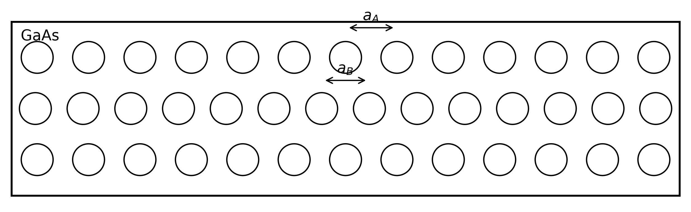
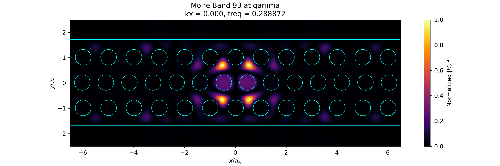

# 2D Moiré Nanobeam Cavity
*GaAs moiré nanobeam cavity
with Q–confinement optimization and emitter-placement tolerance*

## Project Summary
This independent project investigates a commensurate 13:14 three-row GaAs moiré nanobeam cavity. The goal was to identify a design that balances $Q$, effective area, central confinement, and emitter-placement tolerance. Sequential optimization increased the screening-stage $Q$ from approximately $1.0\times10^3$ to $8.0\times10^3$ at resolution 32, while a resolution 52 yielded $7.5\times10^3$ for selected M19 design.

### Key Findings
- Increased the simulated 2D cavity $Q$ from $\approx1.0\times10^3$ to $\approx8.0\times10^3$ at resolution 32.
- Obtained a high-resolution M17 estimate of $Q \approx6.6\times10^3$ at resolution 52.
- Selected M17 over the maximum-$Q$ M19 design because of its smaller effective area and stronger central confinement.
- Found that 75% of accessible GaAs positions within approximately 20 nm of the optimal emitter location retained $\eta_y\ge0.5$.

## Geometry
<p align="center">
  
</p>

<p align="center">
  <em>Commensurate 13:14 three-row ABA moiré supercell</em>
</p>

- The cavity consists of a three-row ABA region with $a_B=(13/14)a_A$, forming a commensurate supercell satisfying $13a_A=14a_B$.
- The finite moiré region is terminated by BBB mirror sections on both sides.
- Scaling the selected normalized resonance to 930 nm gives $a_A\approx266$ nm for GaAs with $\varepsilon_r=13$.

## MPB Mode Screening
<p align="center">
  
</p>

<p align="center">
  <em>TE-like bands 93-95 near the target normalized-frequency range</em>
</p>

<p align="center">
  
</p>

<p align="center">
  <em>Magnetic-field profile of band 93 at the Gamma point, showing confinement within the moiré region </em>
</p>

- MPB was used to identify a narrow TE-like folded-band candidate in the periodic 13:14 ABA supercell. Band 93 exhibited a field profile confined within the moiré region at $\Gamma$ and the Brillouin-zone edge.
- The $H_z$ profiles were used for band screening; the finite-cavity and emitter-placement metrics below were evaluated using $E_y$.

## 2D Meep Optimization
<p align="center">
  
</p>

<p align="center">
  <em>Optimization-stage Q progression</em>
</p>

- A finite ABA cavity was formed by adding BBB mirrors on both sides.
- The mirror-hole radius, central B-row offset, transition-hole radius, and mirror length were optimized sequentially, increasing $Q$ from approximately $1.0\times10^3$ to $8.8\times10^3$ at a resolution of 32 pixels per unit length.

## Candidate Comparison
<p align="center">
  
</p>
<p align="center">
  Normalized y-oriented dipole-coupling maps for the M15, M17, and M19 cavity candidates
</p>

Here, $\eta_y(\mathbf{r})$ denotes the normalized local $E_y$-energy-density proxy, $A_{\mathrm{eff},y}^{(2D)}/a_A^2$ the normalized effective area, and $C_{\mathrm{moire}}$ the fraction of GaAs-weighted $E_y$ intensity within the central moiré region.

|Candidate|$Q$|$A_{\mathrm{eff},y}^{(2D)}/a_A^2$|$Q/(A_{\mathrm{eff},y}^{(2D)}/a_A^2)$|$C_{\mathrm{moire}}$|
|:---|---:|---:|---:|--:|
|M17|6600|1.017|6491|0.897|
|M19|7472|1.065|7014|0.869|
|M21|7174|1.155|6213|0.822|

All candidates were evaluated using identical screening settings at a resolution 52 pixels per unit length.

Although M19 increased $Q$ by approximately 13.2% with respect to M17, $C_{\mathrm{moire}}$ decreased from 0.897 to 0.869. M17 was therefore selected as the better Q-confinement compromise.

## Resolution study
|Resolution|Frequency|Q|Post-source runtime|
|:---|---:|---:|---:|
|36|0.2856|7481|6000|
|40|0.2859|6609|6000|
|44|0.2861|6755|6000|
|48|0.2859|7440|6000|
|52|0.2859|7472|6000|

- The resonance frequency varied by less than 0.2% across the tested
  resolutions.
- The Q estimates at resolutions 48 and 52 differed by approximately 0.4%,
  suggesting stabilization near $Q \approx7.5\times10^3%$ 

## Placement Robustness
<p align="center">
  
</p>
<p align="center">
  Radial statistics of the normalized coupling proxy over accessible
  GaAs positions around the optimal emitter location
</p>

- Under a uniform in-plane placement model over accessible GaAs positions, the estimated half-coupling tolerance was $R_{75}^{(0.5)}\approx37.5$ nm; that is, 75% of positions within this radius retained $\eta_y\ge0.5$.

## Limitations
- The primary optimization was performed using a 2D z-invariant model and therefore does not capture out-of-plane radiation; systematic 3D convergence remains future work.
- The placement analysis assumes a resonant, $y$-oriented dipole.
- Fabrication-disorder analysis and a matched conventional-cavity benchmark remain future work.

## Repository Structure
- code/       MPB and Meep simulation workflows
- figures/    geometry, fields, optimization, and robustness results
- data/       processed numerical results

## Reproduce
```bash
conda env create -f environment.yml
conda activate moire-cavity
```