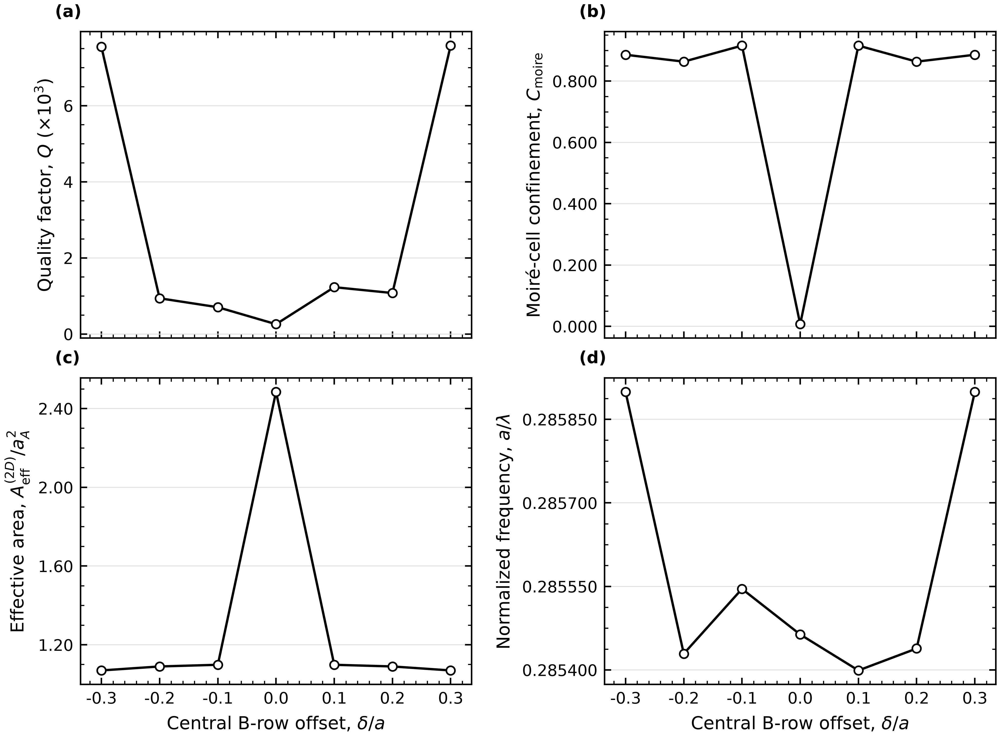
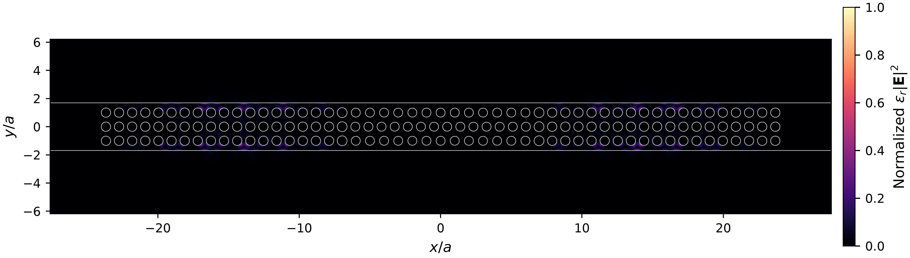
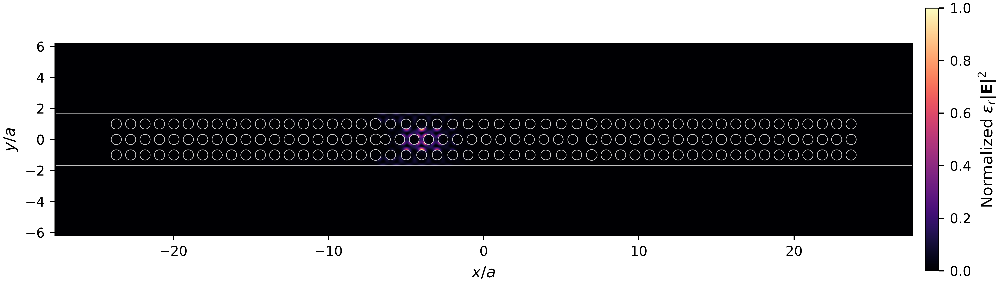
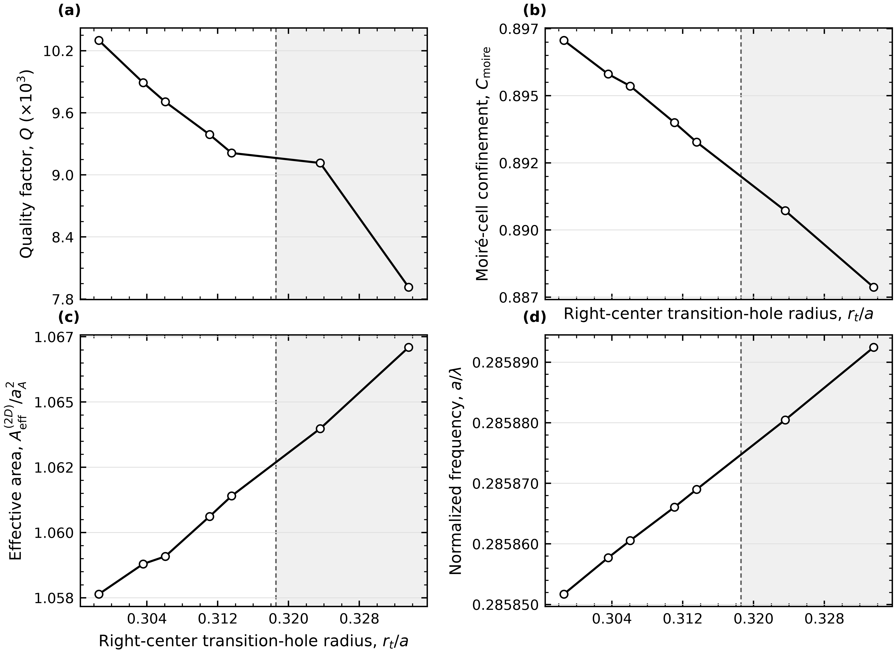
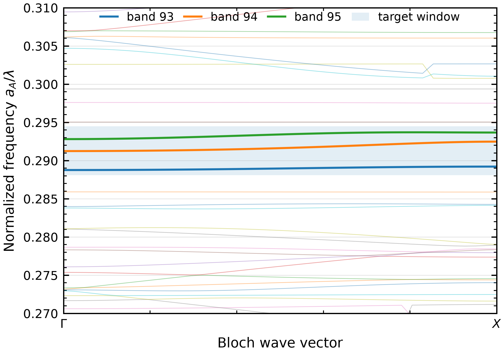
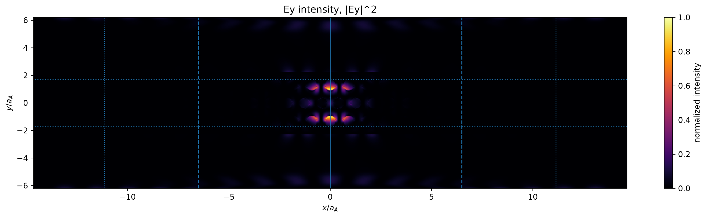
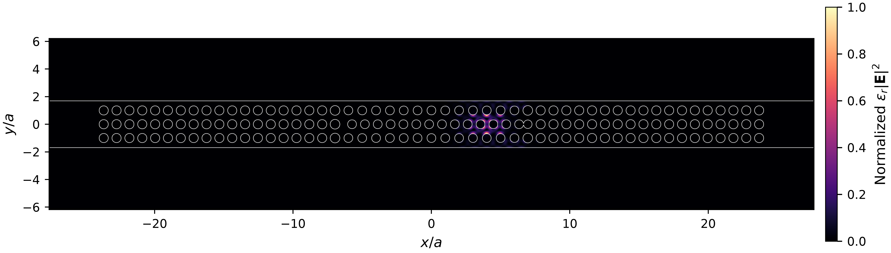

# Position-Selectable Modes in a 2D Moiré Nanobeam Cavity
*Independent 2D computational investigation of registry-controlled mode localization, in-plane leakage, and interface tuning in a three-row GaAs moiré nanobeam*

> **Main result**: In a two-dimensional, $z$-invariant model, shifting the central B row from $\delta = -0.3a_A$ to $+0.3a_A$ selected approximately mirror-related modes localized at opposite longitudinal positions. The best-performing sampled M19 design yielded $Q\approx1.0\times10^4$ at a resolution of 52 pixels per $a_A$.

Technical note: [PDF Download](./technical_note/technical_note.pdf)

## Key Findings
- MPB eigensolver calculations identified TE-like folded bands 93-95 within the target normalized frequency window (0.288100–0.29450).
- Meep FDTD simulation found a resonance with $Q\approx1\times10^3$ for the initial moiré cavity design, which increased to $Q\approx1\times10^4$ through hole-radius optimization, extended BBB mirrors, and local transition-hole tuning.
- Opposite shifts generated symmetry-related modes with nearly identical $Q$ and localization, allowing selection of the mode position.
- Local interface refinement changed cavity leakage while leaving the resonance frequency and other mode metrics nearly unchanged.

## Result Summary

A commensurate 13:14 three-row GaAs moiré nanobeam was studied using MPB eigenmode analysis and Meep finite-difference time-domain simulations.

### $Q$ optimization

| Stage | Configuration | $Q$ | Normalized frequency $(a/\lambda)$ |
|:---|:---|---:|---:|
| Initial finite moiré cavity | ABA cavity | 1044 | 0.284291 |
| Radius-optimized mirror | $M=7$, $r_m/r_0=1.04$ | 2141 | 0.284275 |
| Offset- and transition-optimized | $M=7$, $\delta=+0.30a$ | 4087 | 0.285522 |
| Extended mirror | $M=19$ | 8856 | 0.285571 |
| Locally tuned M19 cavity | $\delta=+0.30a$, $r_t/a=0.298571$ | 10299 | 0.285850 |

*The table summarizes the optimization trajectory rather than a controlled single-parameter sweep. The final design was evaluated at resolution 52.*

Extended mirrors and radius optimization reduced in-plane leakage and improved the resonance $Q$. As a result, $Q$ increased by approximately 9.9 times compared with the initial design.

In the separate mirror-length comparison, M27 produced a higher $Q$ than M19, but M19 was selected because it maintained stronger moiré-cell confinement and a smaller effective area.

### Moiré Offset Selection
<p align="center">
  
</p>

<p align="center">
  <em>Dependence of Q, moire  cell confinement, effective area, and normalized frequency on the central B-row offset</em>
</p>

<p align="center">
  
</p>

<p align="center">
  <em>Normalized ε|E|^2 profile at offset 0</em>
</p>

<table align="center">
  <tr>
    <td align="center">
      <br>
      <em>Normalized ε|E|^2 profile at offset offset −0.3</em>
    </td>
    <td align="center">
      <br>
      <em>Normalized ε|E|^2 profile at offset offset +0.3</em>
    </td>
  </tr>
</table>

In the offset comparison, shifting the center row of the moiré cell by $\delta=\pm0.3a$ produced symmetry-related modes localized at opposite positions while maintaining $Q\approx7.5\times10^3$. In the idealized 2D model, this result indicates that the localized mode position can be selected by defining the relative row registry during fabrication.

### Local transition mirror radius $r_t$
<p align="center">
  
</p>

<p align="center">
  <em>Dependence of Q, frequency, effective area, and moiré-cell confinment on the transition-hole radius</em>
</p>

To investigate the effect of the interface region (border between the moiré cell and transition mirror), the radius of one transition hole ($r_t$) was varied. As a result, the $Q$ factor changed depending on $r_t$, whereas other metrics remained nearly unchanged. The result indicates that the local interface region controls a leakage-sensitive dielectric-boundary perturbation. The resulting geometry variation changed the cavity $Q$ by approximately 23% while producing only a 0.014% shift in normalized resonance frequency.

## Workflow
**Method** MPB was first used to identify candidate TE-like folded bands and field symmetries in the periodic ABA supercell. The selected candidates were then transferred to finite moiré structures and tested through FDTD optimization and numerical convergence.

1. **MPB Mode Screening**
Identify folded-band candidates and relevant field symmetries in the periodic ABA supercell.
<p align="center">
  
</p>
<p align="center">
  <em>TE-like bands 93-95 near the target normalized-frequency range (0.288100–0.29450)</em>
</p>

2. **Finite-Cavity Validation**
Transfer candidate modes to Meep and check $Q$, localization, and numerical convergence.
<p align="center">
  
</p>
<p align="center">
  <em> Ey profile of the initial design</em>
</p>

3. **Further Optimization** 
To enhance $Q$ while maintaining localization
  <p align="center">
  
</p>

<p align="center">
  <em>M19 - Offset and mirror engineered geometry</em>
</p>

4. **Investigate Characteristics**
Compare zero and nonzero offsets, then vary one local interface hole at fixed offset to separate registry effects from local interface-leakage effects.

## Limitations
- The primary optimization was performed using a 2D z-invariant model and therefore does not capture out-of-plane radiation; systematic 3D convergence remains future work.
- The quantum-emitter placement interpretation assumes a resonant, $y$-oriented dipole; an explicit dipole-position or Purcell-factor sweep was not performed.
- Fabrication-disorder analysis and a matched conventional-cavity benchmark remain future work.

## Repository Structure
- code/       MPB and Meep simulation workflows
- figures/    geometry, fields, and optimization
- data/       processed numerical results

## Reproduce
The full-resolution R=52 run is computationally expensive and may require several hours, depending on hardware.
```bash
conda env create -f environment.yml
conda activate moire_cavity
python code/Meep/final_design_moire.py
```